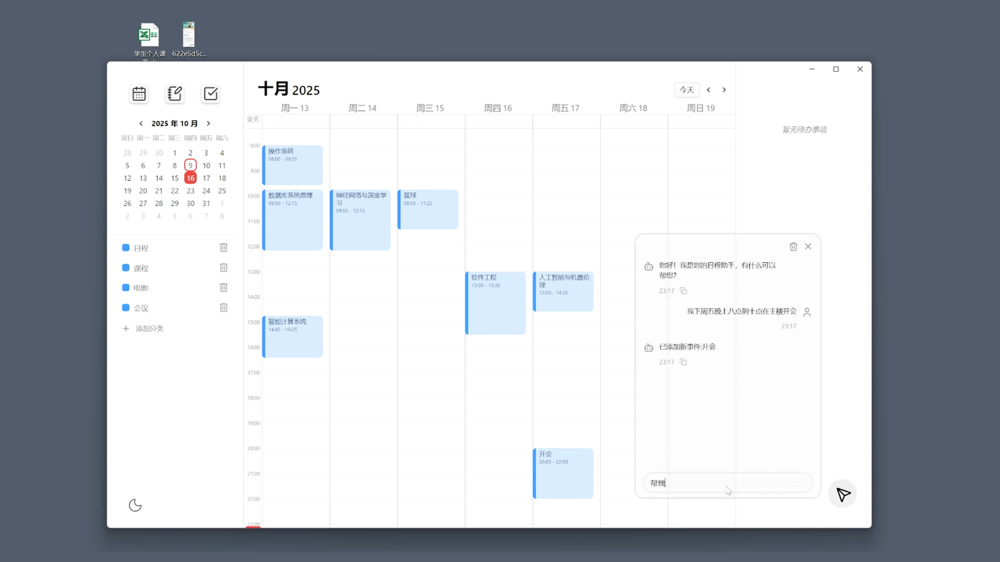
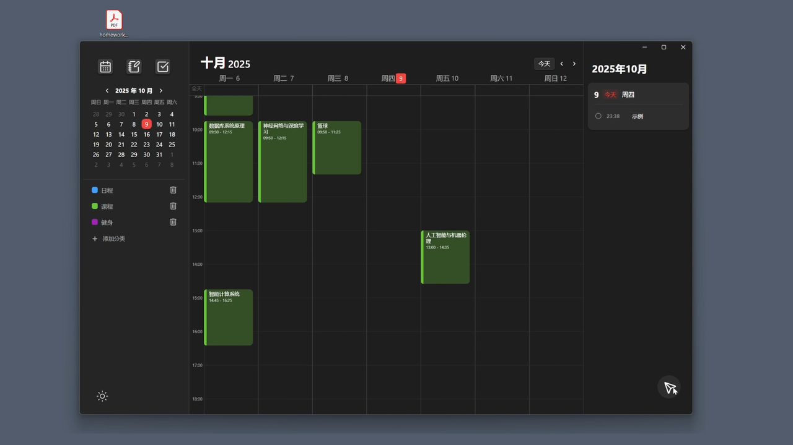
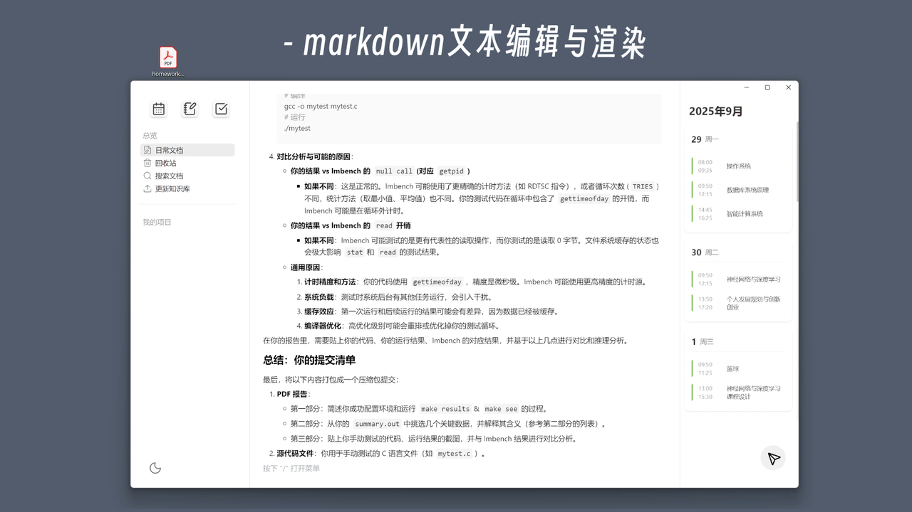

<div align="center">

# FlowCalendar

**一款 AI 驱动的桌面端日程 / 待办 / 笔记一体化工作台**
**An AI-powered all-in-one calendar · todo · notebook desktop workspace**

[](https://www.electronjs.org/)
[](https://vuejs.org/)
[](https://vitejs.dev/)
[](https://flask.palletsprojects.com/)
[](https://www.langchain.com/langgraph)
[](https://www.bilibili.com/video/BV1oqcrzwEJo/)

[演示视频 Demo](https://www.bilibili.com/video/BV1oqcrzwEJo/) ·
[功能 Features](#-功能亮点--features) ·
[快速开始 Quick Start](#-快速开始--quick-start) ·
[配置 Settings](#-设置中心--settings)

</div>

---

## 简介 / Overview

FlowCalendar 把日历、待办、笔记和一个会聊天的 AI 助手装进同一个桌面应用。
你可以用自然语言、截图、Excel 表格让 AI 帮你抽取并安排日程，所有数据本地持久化，
随时切换 DeepSeek / 通义 DashScope 等大模型，明暗主题一键切换。

FlowCalendar bundles a calendar, a to-do board, a notebook and an AI agent
into one desktop app. Drop natural language, screenshots or spreadsheets into the chat —
the agent extracts events, fills your schedule and indexes everything locally with FAISS.
Switch between DeepSeek / DashScope (Qwen) models on the fly and toggle dark mode with one click.

> 完整功能演示请观看 Bilibili：<https://www.bilibili.com/video/BV1oqcrzwEJo/>

---

## ✨ 功能亮点 / Features

| | |
| --- | --- |
| 📅 **日历日程** Calendar | 周/日视图、分类着色、可重复事件、跨天事件 |
| ✅ **待办看板** To-Do | 项目分组、标签、四级优先级、重复规则、淡入淡出动画 |
| 📝 **笔记文档** Notebook | 富文本（Tiptap）、事件关联、全文检索、外部 Markdown / 图片 / 表格导入 |
| 🤖 **AI 助手** Agent | LangGraph 工作流，文本 / 图片 / 表格三种输入抽取日程，流式回复 |
| 🔍 **本地 RAG** | FAISS 向量检索，所有笔记内容可被 Agent 引用 |
| ⚙️ **设置中心** Settings | 右上角齿轮入口，配置 DeepSeek / DashScope 的 Base URL、API Key，切换主题 |
| 🎨 **明暗主题** Theme | 即时切换，原生 Windows 标题栏颜色随之同步 |

---

## 🖼 截图 / Screenshots

<table>
  <tr>
    <td align="center"><br/>明亮主题 Light</td>
    <td align="center"><br/>暗色主题 Dark</td>
  </tr>
  <tr>
    <td colspan="2" align="center"><br/>笔记 Notebook</td>
  </tr>
</table>

---

## 🛠 技术栈 / Tech Stack

- **前端 Frontend**：Vue 3 · Pinia · Vue Router · Element Plus · Tiptap · Lucide
- **桌面壳 Desktop**：Electron 30 · vite-plugin-electron
- **构建 Build**：Vite 5 · vue-tsc · electron-builder
- **后端 Backend**：Flask · Flask-SQLAlchemy · SQLite
- **AI / RAG**：LangGraph 0.6 · LangChain · FAISS · DeepSeek · 通义 DashScope (Qwen)

---

## 🚀 快速开始 / Quick Start

### 环境要求 / Prerequisites

- **Node.js** 18+
- **Python** 3.10 / 3.11 推荐
- **Windows**（当前数据路径基于 `~/Documents`，跨平台需自行调整）

### 1) 克隆 / Clone

```bash
git clone https://github.com/HenryNotTheKing/FlowCalendar.git
cd FlowCalendar
```

### 2) 安装依赖 / Install

```bash
# 前端 Frontend
npm install

# 后端 Backend
cd src/backend
pip install -r requirements.txt
cd ../..
```

### 3) 启动后端 / Start backend

```bash
python src/backend/app.py
# Flask 监听 http://localhost:5000
```

### 4) 启动桌面端 / Start desktop app

新开一个终端：

```bash
npm run dev
```

Electron 会自动加载 Vite 开发服务器，前后端联调完毕。

### 5) 打包 / Build

```bash
npm run build
```

产物输出至 `build/`（由 `electron-builder.json5` 控制）。

---

## ⚙️ 设置中心 / Settings

应用顶栏右上角的 **齿轮按钮** 打开设置面板（位于 Windows 原生最小化/最大化/关闭按钮的左侧）：

| 分区 Section | 说明 Description |
| --- | --- |
| **外观 Appearance** | 明 / 暗主题切换；Windows 标题栏颜色实时同步 |
| **DeepSeek** | 自定义 Base URL 与 API Key（用于 `deepseek-v4-flash`） |
| **通义 DashScope** | 自定义 Base URL 与 API Key（用于 `qwen3-coder-flash` / `qwen-flash` / `qwen-vl-ocr`） |

行为规则：

- API Key 仅以掩码形式回显（如 `sk-2***...c369`）；输入框留空表示**保留旧值**。
- 配置写入 `~/Documents/FlowCalendar/llm_config.json`，**重启后端后**生效。
- 缺省时按优先级回退：配置文件 → 环境变量 (`DEEPSEEK_API_KEY` / `DASHSCOPE_API_KEY`) → 内置默认值。

---

## 📂 数据存储位置 / Data Locations

所有用户数据写入 Windows 文档目录，方便备份与迁移：

```
~/Documents/FlowCalendar/
├── flowcalendar.db        # SQLite 主数据库
├── llm_config.json        # 模型与主题配置
├── faiss_index/           # RAG 向量索引
└── resources/             # 用户上传/转换的外部文档
```

---

## 🤝 贡献 / Contributing

欢迎 Issue 与 PR！建议先在 Issue 中说明你想改动的方向。

1. Fork 本仓库
2. 创建分支：`git checkout -b feat/your-feature`
3. 提交：`git commit -m "feat: ..."`
4. 推送 & 发 PR

---

## 📜 License

MIT © [HenryNotTheKing](https://github.com/HenryNotTheKing)
